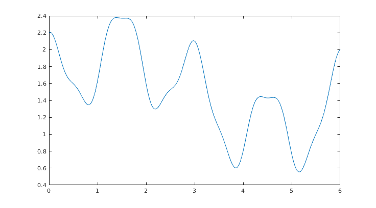
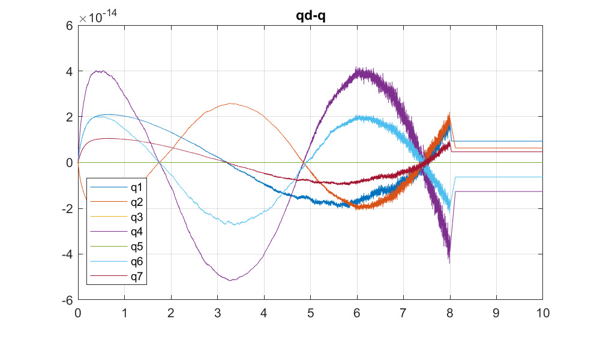
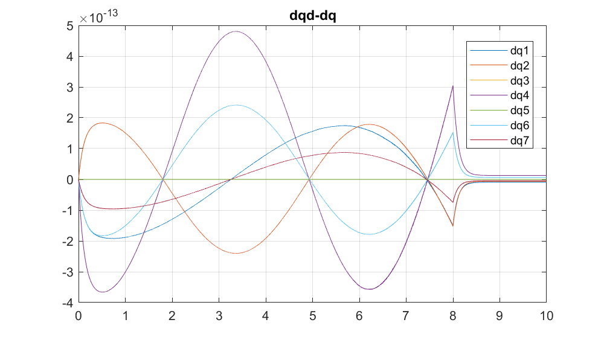

# Robotik 2 Übung
## Aufgabe 2.1 
###### files: start.m

// TODO 
// -[ ] Erklären wie man auf Funktion 4 kommt. 

## Aufgabe 2.2 
###### files: contact_force/contact_start.m

// TODO 
// - [ ] Def holonom Zwangsbedingung suchen
// - [ ] Wie bestimmt man A, dA

## Aufgabe 2.3 
###### files: contact_force/contact_start.m

Qualitativ identisch mit Verlauf 1. 

## Aufgabe 2.4 
###### files: control/init_ComputedTorque.m

Wie viele Trajektorien? Reicht eine? Welche Fälle sollen abgedeckt werden?

## Aufgabe 2.5 
###### files: control/init_ImpedanceController.m

## Aufgabe 2.6 
###### files: control/init_PDplusController.m

