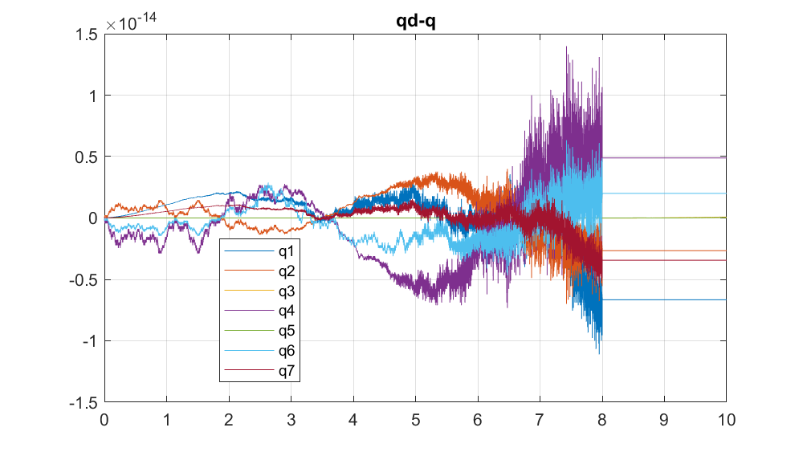
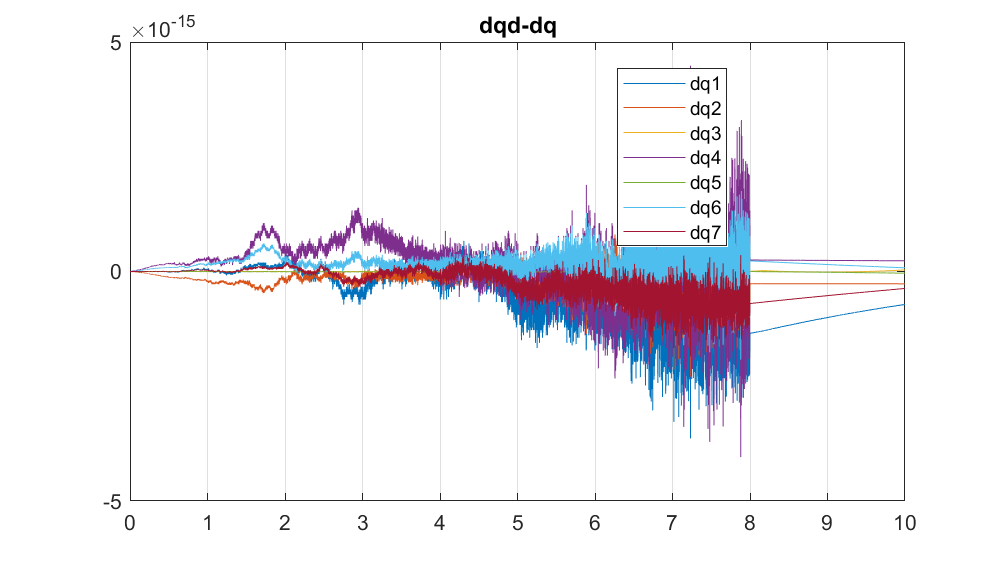
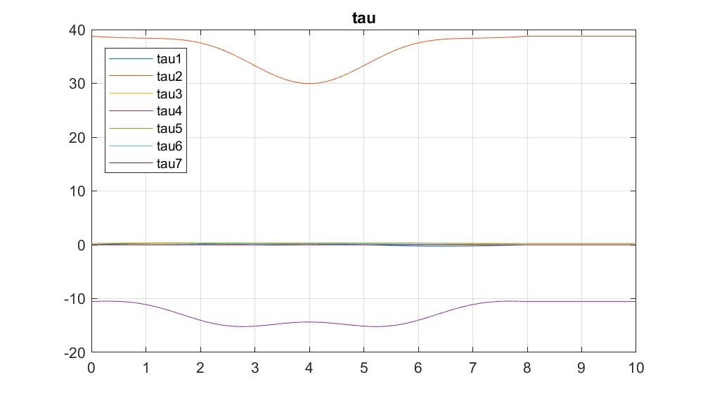
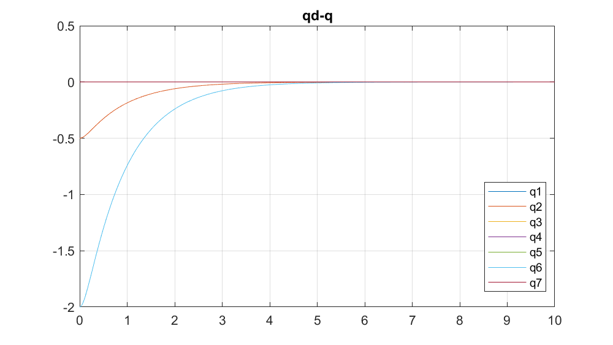

# Robotik 2 Übung
## Aufgabe 2.1 
###### files: start.m

### Func1 
Funktion1 ist es nicht weil passivität nicht erfüllt ist 

### Func2 

Werte der Gelenke 1,3,5,7 müssen 0 sein. Hier nicht erfüllt. 
g =[0.0814,-54.1212,-0.3612,14.7931,-0.3436,-0.3072, 0] 

### Func3 

Eigenwert von M = [-0.5555,0.0434,0.0982,0.0993,0.1013,0.1066,0.3789]
Nicht Matrix ist nicht Pos. Def. => nicht erfüllt. 

### Func4 

Erfüllt alles 

### Func5 

M(7,7) < 0.1 laut Angabe >=0.1

## Aufgabe 2.2 
###### files: contact_force/contact_start.m

 z(q)-0.2 = 0
- [] Formel raussuchen 
 df(q)/dq = J_a % Aber wir betrachten nur z Achse => J_g auch ok
 A= Jg(3,:)
 dA = dJg(3,:) % zeitlich Ableitung von Jg = zeitliche Ableitung von A

## Aufgabe 2.3 
###### files: contact_force/contact_start.m

Qualitativ identisch mit Verlauf 1. 

## Aufgabe 2.4 
###### files: control/init_ComputedTorque.m
|Fall| q0|dq0|
|---|---|---|
|1|qd_0|dqd_0|
|2|[0; pi/4+0.5; 0; -pi/2; 0; pi/4+2;0]|dqd_0|
|3|[0; pi/4+0.5; 0; -pi/2; 0; pi/4+2;0]|$\pi/4$ alle gelenke| 

### Fall 1 

Finding 1: 
> $\tau$ nicht von k1 und k2 abhängig. 

Finding 2: 
> Je größer K1 und K2. Desto weniger Rauschen bei "keiner" Differenz. 

Finding 3: 
> Hier Differenz ist wie erwartet 0. Numerisch "sehr nahe" bei Null. 

### Fall 2 

Finding 1 
> $\tau$ wenn k1, k2 100 ist verhält es sich nicht der Realität entsprechend. 

Finding 2 
> Die Gelenksgeschwindigkeiten sind bei k1, k2 = 100 sehr hoch und entsprechenden nicht mehr der Realität. Bei 10 sieht es realitätsnaher aus. Bei k1,k2 = 1 ist die Regelung langsam. Dementsprechend ist die Regelung bei k1, k2 = 0.1 "sehr langsam" und nicht brauchbar. $\rightarrow$ k1,k2 = 10 ist unsere Wahl. 

Finding 3 

> Alle k1,k2 außer 0.1 konnten den Regelfehler gegen 0 regeln in T sec. Zwischen 10 und 100 konnten praktisch keine Unterschiede festgestellt werden. 

### Fall 3 

Finding wie 
> $\tau$  selbes Problem wie im Fall 2. 

## Aufgabe 2.5 
###### files: control/init_ImpedanceController.m

Startkonfiguration:  q0 = [0 pi/4 0 -pi/2 0 pi/4 0]'

Reglerparameter: 
- Dämpfungskonstante sollte allg. größer 0 (Pos. def.) aber bei uns >=89 sein. 
- Steifigkeitskonstante > 
- $l=3$ für alle Argumentationen
- $d=k=10$ für alle Argumentationen

|fall| findings|
|---|---|
|1.1| Nur numerische Fehler erkennbar in x und dx.|
|1.2| Nach Ablauf der Regelzeit gibt es noch eine Differenz (mm-Bereich) |
|2.1| Nach Ablauf der Regelzeit kommt es zu einer Differenz im µm-Bereich.$\Rightarrow$ Gelenke bewegen sich minimal. Gelenkmomente bleiben konstant.|
|2.2| Abweichung wegen Störkraft anschließend wie Fall 1.2|

## Aufgabe 2.6 
###### files: control/init_PDplusController.m

